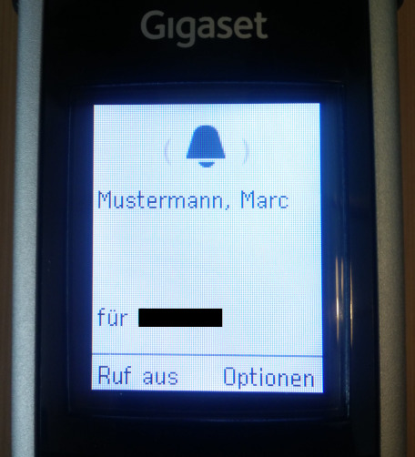
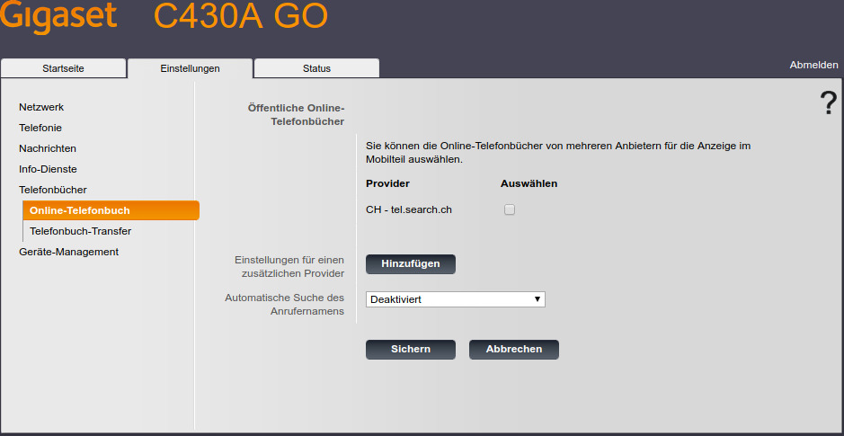
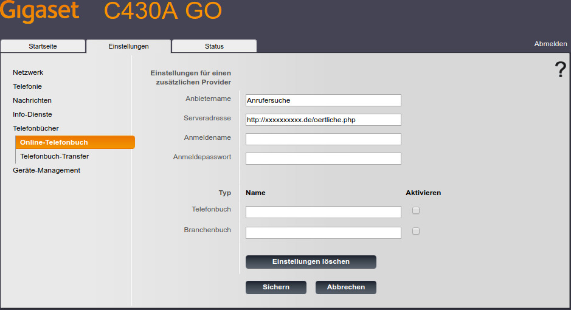
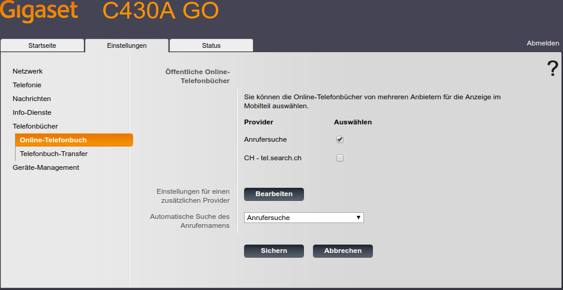

# Anrufersuche
Telefonbuch-Skript zur Anrufersuche für Gigaset-Telefone



## Installation
1. Skript `oertliche.php` auf Webserver mit PHP-Interpreter hochladen
2. Aufruf im Browser testen:
```
<list response="get_list" type="pb" notfound="hm" total="0"/>
```
3. In Weboberfläche der Basisstation anmelden,
unter dem Reiter `Einstellungen` zum Menüpunkt `Telefonbücher` -> `Online-Telefonbuch` navigieren und
den Button `Hinzufügen` beim Punkt ***Einstellungen für einen zusätzlichen Provider*** anklicken.

4. Dort einen beliebigen `Anbietername` und die URL zum PHP-Skript (Punkt 2) als `Serveradresse` eintragen sowie
über den Button `Sichern` abspeichern.

5. Neben dem angelegten Telefonbuch-Provider den Haken bei `Auswählen` setzen und
über den Button `Sichern` bestätigen. Anschließend diesen Eintrag bei ***Automatische Suche des Anrufernamens*** auswählen und
nochmals mit `Sichern` übernehmen.


## Addendum
Inspiriert von [Roland Greim](https://github.com/tigerxy/OnlineTelefonbuch)s Skript,
implementiert nach Gigasets [Phonebook Search Protocol](https://teamwork.gigaset.com/gigawiki/display/GPPPO/Online+directory).

[](https://www.paypal.com/cgi-bin/webscr?cmd=_s-xclick&hosted_button_id=CLG7D8PD7A88Q&source=url)
